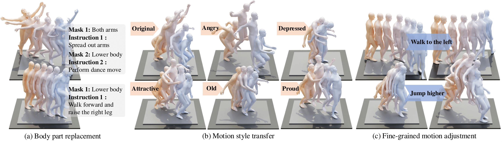

# Dynamic Motion Blending for Versatile Motion Editing


This is the code repository of **Dynamic Motion Blending for Versatile Motion Editing** at **CVPR 2025**.

📝 [**arXiv**](https://arxiv.org) | 🌐 [**Project Page**](https://awfuact.github.io/motionrefit) | 🤗 [**Hugging Face Space**](https://huggingface.co/spaces/Yzy00518/motionReFit)

# Getting Started

### Prerequisites  
To run the application, you need to have the following installed:  
- Python 3.10
- Required Python packages (specified in `requirements.txt`)
- git-lfs

### Installation

1. **Clone the Repository**:
    ```sh
    git clone https://github.com/emptybulebox1/motionReFit.git
    cd motionRefit
    ```

2. **Download Checkpoints and SMPL-X Models**:
    - You can find them in https://huggingface.co/Yzy00518/motionReFit, where contains all checkpoints and data required for demo.
    - You can also run app.py, which can automatically download all weights from huggingface repo and put them to correct position.

3. **Install Python Packages**:
    ```sh
    pip install -r requirements.txt
    ```

### Running the Application

  - Before running the application, use git-lfs to pull data from this repo
    ```sh
    git-lfs install
    git-lfs pull
    ```
  - Then start the Gradio application:
    ```sh
    python app.py
    ```

# Training

  - Comming soon!

# STANCE Dataset



STANCE (Style Transfer, Fine-Grained Adjustment, and Body Part Replacement) is a comprehensive motion editing benchmark that encompasses three common types of motion editing tasks.

### Tasks

#### 1. Regeneration (Body Part Replacement)

This task focuses on precise modifications of specific body part movements. For example, _“replace a waving right hand with a swinging motion”_ or _“change a walking leg movement to running”_. To support this task, we have annotated 13,000 motion sequences. Each sequence is tagged with precise body part masks (UPPER_BODY, LOWER_BODY, BOTH_ARMS, LEFT_ARM, RIGHT_ARM) along with corresponding motion descriptions.

#### 2. Style Transfer

This task is designed to change the stylistic expression of a motion while preserving its semantic content. For example, _“transform a calm gesture into an angry one”_. We collaborated with experienced motion capture actors to perform multiple emotional and stylistic variations of the same motion. In total, we collected approximately 2 hours of high-quality footage, covering styles such as sexy, angry, and old.

#### 3. Fine-Grained Adjustment

This task involves subtle modifications of motion characteristics such as amplitude and force — for example, _“walk faster”_ or _“increase the swing of a hand wave”_. To support this, we have constructed 4,500 motion pairs along with editing descriptions. These triples were partially generated using large language models and later validated by experts to ensure quality.

### Usage

Please download the STANCE dataset from [Google Drive](https://drive.google.com/file/d/1LiNgkRZ-Kmv5rKI3BOaHVCudhrMtE5hx/view?usp=sharing). The content inside the download link will be continuously updated to ensure you have access to the most recent data.

The file structure should be like:
```plaintext
dataset/
├── base_motion
│   ├── 000000.pkl
│   ├── 000002.pkl
│   ├── ...
│   └── 029231.pkl
├── regen
│   ├── mask_all.json
│   └── part_annotations.json
├── style_transfer
│   ├── 000009_depressed.pkl
│   ├── 000009_proud.pkl
│   ├── ...
│   └── 000642_sexy.pkl
├── adjustment
│   ├── paired_data_seed0_15_batch0_id3.pkl
│   ├── paired_data_seed0_15_batch0_id5.pkl
│   ├── ...
│   └── paired_data_seed2_13_batch4_id129.pkl
├── split
│   ├── base_motion
│   │   ├── val.txt
│   │   └── test.txt
│   ├── style_transfer
│   │   ├── val.json
│   │   └── test.json  
│   └── adjustment
│       ├── val.json
│       └── test.json  
└── README.md
```

Explanation of the files and folders of the STANCE dataset:

- **base_motion (folder):** SMPL-X format motion data from HumanML3D (24746 in total, 20 FPS).
- **regen (folder):** Motion data for body part replacement is in **base_motion**.
    - **mask_all.json:** Annotated body parts, where each key is a HumanML3D ID.
    - **part_annotations.json:** Text annotations of annotated body parts, where each key is a HumanML3D ID.
- **style_transfer (folder):** SMPL-X format motion data for motion style transfer (749 in total, 20 FPS).
- **adjustment (folder):** SMPL-X format motion data for fine-grained motion adjustment (4411 in total, 20 FPS).
- **split (folder):** Dataset split of different subsets.
    - **base_motion (folder):** Official Val & Test splits from HumanML3D.
    - **style_transfer (folder):** Val & Test pairs used in MotionReFit.
    - **adjustment (folder):** Val & Test pairs used in MotionReFit.
- Data format for `.pkl` files in **base_motion** and **style_transfer**:
    ```plaintext
    {   
        "body_pose": numpy.ndarray (N, 63),
        "global_orient": numpy.ndarray (N, 3),
        "transl": numpy.ndarray (N, 3),
    }
    ```
- Data format for `.pkl` files in **adjustment**:
    ```plaintext
    {
        "src": {   
            "body_pose": numpy.ndarray (N, 63),
            "global_orient": numpy.ndarray (N, 3),
            "transl": numpy.ndarray (N, 3),
        },
        "tgt": {   
            "body_pose": numpy.ndarray (N, 63),
            "global_orient": numpy.ndarray (N, 3),
            "transl": numpy.ndarray (N, 3),
        },
        "body_part": body part to edit,
        "text": editing instruction,
    }
    ```

**Note: During the training process of motion style transfer and fine-grained motion adjustment, only the blended motions (generated as `BLD(base_motion, adjustment_motion)`) are available.**

# Citation

```plaintext
@article{jiang2025dynamic,
  title={Dynamic Motion Blending for Versatile Motion Editing},
  author={Jiang, Nan and Li, Hongjie and Yuan, Ziye and He, Zimo and Chen, Yixin and Liu, Tengyu and Zhu, Yixin and Huang, Siyuan},
  journal={arXiv preprint arXiv:2503.20724},
  year={2025}
}
```

# Related Repos

We adapted some code from other repos in data processing, training, evaluation, etc. Please check these useful repos.
```plaintext
https://github.com/jnnan/trumans_utils
https://github.com/mileret/lingo-release
https://github.com/atnikos/motionfix
https://github.com/GuyTevet/motion-diffusion-model
https://github.com/Mathux/TMR
```
