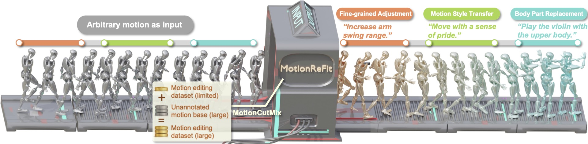

# Learning with Dynamic Motion Blending for Versatile Motion Editing  

This is the code repository of the CVPR25 paper **"Learning with Dynamic Motion Blending for Versatile Motion Editing"**.  

  

📝 [**arXiv**](https://arxiv.org) | 🌐 [**Project Page**](https://awfuact.github.io/motionrefit) | 🤗 [**Hugging Face Space**](https://huggingface.co/spaces/Yzy00518/motionReFit)  
---  

## Getting Started  
### Prerequisites  
To run the application, you need to have the following installed:  
- Python 3.8  
- Required Python packages (specified in `requirements.txt`)


### Installation

1. **Clone the Repository**:
    ```sh
    git clone https://github.com/emptybulebox1/motionRefit.git
    cd motionRefit
    ```

2. **Download Checkpoints and SMPL-X Models**:
    - You can find them in https://huggingface.co/Yzy00518/motionReFit, where contains all checkpoints and data required for demo.

3. **Install Python Packages**:
    ```sh
    pip install -r requirements.txt
    ```

### Running the Application
  - To start the Gradio application:
    
  ```sh
  python app.py
  ```


## Training & Dataset
  - comming soon!
